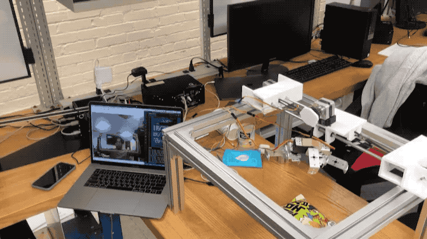
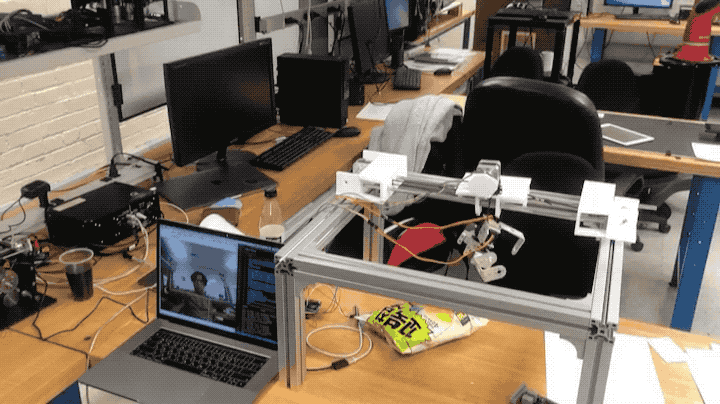

# Claw Machine 

> 🇺🇸Global Capstone Design at North Carolina A&T State University | 2020.01.06 ~ 09(UTC+0)

## Summary

I participated in Chungnam National University's global capstone design program. It was a Jan. 2-12 schedule in North Carolina, the United States, and a time for Capstone, which runs from Jan. 6 to Jan. 9 at North Carolina A&T State University. 

We decided to create a claw machine using motion recognition and focused on it for four days. The hardware configuration was made by referring to the X-Y plotter and by handmade because there was no 3D printer. So although it was originally intended to control two axes (x,y), only one axis (x) was left.

The motion recognition part was recognized using the tensorflow model, Posenet. Using a WebSocket, the value of the Posenet was sent to Python, and Python analyzed it in real time so that users can recognize it as a preset setting when a particular pose was taken. 

As you can see from the example below, each pose has led to a specific signal being sent to the aduino via the MQTT protocol, all of which can be operated in a WiFi environment. To this end, noodemcu was connected to aduino as a serial. 

It was my first time in America, but I think it will be a very good memory. First of all, I loved being able to exchange information that we knew with local students. The six-month U.S. internship at Nanocellect from March has been confirmed during this program, and I think it really helped me a lot. It was very satisfying in every way.

## Demonstrate

<p align="center">
  
</p>
<p align="center">
    <b>Pose for left movement control</b>
</p>
<p align="center">
  
</p>
<p align="center">
    <b>Pose for right movement control</b>
</p>
<p align="center">
  
</p>
<p align="center">
  
  
</p>
<p align="center">
    <b>Pose for decision control</b>
</p>


## Material

> Structure

- Aluminium profile 40x40 50cm * 8
- Polishing rod 8Ø 50cm * 4, 5Ø 60cm * 1
- Flange bearing
- Ball bearing
- Motor Coupling
- Linear ball bush(LM8LUU)
- Pully
- GT2 timing belt

> Control

- nodemcu 
- Arduino UNO 
- Dual bipolar stepper motor shield(A4988)
- ROB-09238 * 3

> Power

- DC jack power cable
- 12V 1.5A adapter(DC)

## Setup

- posenet

```sh
$ yarn --watch
$ yarn websocket

enter http://localhost:1234
```

- backend

```sh
$ pip install tornado
$ cd _backend
$ python pose.py

```

## Reference
- [Human_pose_estimation_drone_control](https://clever.coex.tech/en/human_pose_estimation_drone_control.html)
- [X-Y Plotter](https://kocoafab.cc/make/view/648)